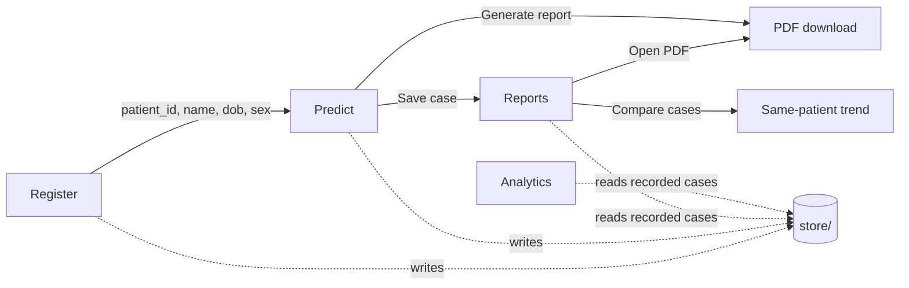

# PancraDX Dashboard — Documentation

**Source:** `dashboard/` (Streamlit app), `src/inference.py`, `src/imaging/preprocessing.py`
**Purpose:** a multimodal early-PDAC risk dashboard that consumes the project's already-trained,
already-calibrated artifacts under `checkpoints/{clinical,imaging,fusion}/final/` and never
retrains or refits anything. Five pages: **Register → Predict → Analytics → Reports → About**.
**Built:** 2026-07-20 to 2026-07-21, across several sessions with live iteration based on
direct usage feedback. **Total new code:** ~2,480 lines across 11 files (see Section 3.1
for the exact per-file breakdown).

This document is written to be mined directly for the formal FYP write-up — it's more
granular than a typical developer README on purpose, with exact formulas, exact file/line
counts, exact validation numbers, and a chronological build narrative, not just a summary.

---

## Table of contents

1. [What it does](#1-what-it-does)
2. [Quick-reference sheet](#2-quick-reference-sheet-formulas-thresholds-tokens)
3. [Architecture](#3-architecture)
4. [Inference integration (`src/inference.py`)](#4-inference-integration-srcinferencepy)
5. [Raw NIfTI preprocessing (`src/imaging/preprocessing.py`)](#5-raw-nifti-preprocessing-srcimagingpreprocessingpy)
6. [Pages — full UI inventory](#6-pages--full-ui-inventory)
7. [Storage schema](#7-storage-schema)
8. [Session-state design](#8-session-state-design)
9. [Analytics — full chart inventory](#9-analytics--full-chart-inventory)
10. [Biomarker reference ranges — what's asserted vs. observed](#10-biomarker-reference-ranges--whats-asserted-vs-observed)
11. [Design decisions and their rationale](#11-design-decisions-and-their-rationale)
12. [Real bugs found during the build](#12-real-bugs-found-during-the-build)
13. [Validation & testing methodology](#13-validation--testing-methodology)
14. [Dependencies added](#14-dependencies-added)
15. [Build timeline](#15-build-timeline)
16. [Running it](#16-running-it)
17. [Known follow-ups](#17-known-follow-ups-not-yet-built)

---

## 1. What it does

A user registers a patient (name, date of birth, sex — collected once), then on the Predict
page provides a CT scan (raw `.nii.gz` upload), a urinary-biomarker row, or both. Each
available branch produces a calibrated probability; if both ran, a fixed rule
(0.4·imaging + 0.6·clinical) combines them into one score. Grad-CAM shows where the imaging
model looked; SHAP shows which biomarkers moved the clinical score. Results can be saved
(building a local case history) and exported as a PDF report. Analytics and Reports then
let the user explore and compare everything that's actually been recorded in the running
dashboard — not the training dataset, which lives in About instead.

**Everything downstream of the models is honest arithmetic, not new modelling** — no
retraining, no re-fitting, no invented numbers. Where a real value is missing (e.g. a
patient registered before a field existed), the app says so and offers a one-time fix
rather than guessing or crashing.

---

## 2. Quick-reference sheet (formulas, thresholds, tokens)

Everything a reader needs without hunting through code, in one place.

### Fusion formula
```
fused_score = 0.4 × imaging_calibrated_proba + 0.6 × tabular_calibrated_proba
```
A fixed, hand-set rule — never fitted, since no patient in the training data has both a CT
scan and a urine sample to validate a blend against.

### Risk-band thresholds (UI convention, not a clinical cutoff)
| Band | Range |
|---|---|
| Low | score < 0.30 |
| Moderate | 0.30 ≤ score < 0.70 |
| High | score ≥ 0.70 |

### Confidence formula (Analytics)
```
confidence = |score − 0.5| × 2      # 0 = right at the decision boundary, 1 = maximally confident
```
Computed from the dashboard's own recorded cases — explicitly not the same statistic as the
training-time calibration Brier scores (Imaging 0.030→0.028, Clinical 0.121→0.119).

### Sex encoding (matches the training pipeline exactly)
`Female = 0`, `Male = 1` — per `docs/Tabular_Preprocessing_documentation.md`, Section 5.

### Age computation
```
age = today.year − dob.year − ((today.month, today.day) < (dob.month, dob.day))
```
Computed live on every Predict page render (`storage.compute_age`) — **never stored**, so
it is always current regardless of how long ago the patient was registered.

### Locked colour palette
| Token | Hex | Used for |
|---|---|---|
| Ground | `#EEF4F5` | page/app background |
| Surface | `#FFFFFF` | cards |
| Primary (blue-teal) | `#17879B` | primary actions, clinical branch |
| Primary deep | `#0F5F6E` | headings |
| Accent / high-risk | `#E5564C` | High risk band, PDAC/Cancer positive |
| Low / green | `#4FB08A` | Low risk band, Not-PDAC/Healthy |
| Amber (caveats) | `#C98A2E` | Moderate risk band, disclosure notes |
| Ink | `#1B2C31` | body text |
| Secondary text | `#5F7278` | captions/subtext |
| Hairline | `#E0EAEC` | borders |
| Imaging branch accent | `#8FBDC4` | distinguishes imaging from clinical in grouped charts |

Applied via `.streamlit/config.toml` (native theme) plus a small custom CSS block in
`dashboard/common.py` for the card/hero/ring/read-box/pill components that Streamlit has no
native equivalent for.

### Biomarker feature order (must match the model exactly)
```python
TABULAR_FEATURES = ["creatinine", "LYVE1", "REG1B", "TFF1", "plasma_CA19_9", "age", "sex"]
```

---

## 3. Architecture

### 3.1 File-by-file breakdown

| File | Lines | Role |
|---|---|---|
| `dashboard/app.py` | 18 | Entry point — `st.navigation` over the 5 pages |
| `dashboard/common.py` | 379 | Palette, custom CSS, cached model/data loaders, shared UI components (cards, hero, score ring, SHAP/branch bar rows, tooltips) |
| `dashboard/storage.py` | 180 | `patients.csv` + `reports/` case store — the only place dashboard-owned state lives |
| `dashboard/report_pdf.py` | 186 | PDF case-report generator (`reportlab`) + trailing-blank-page fix (`pypdf`) |
| `dashboard/pages/register.py` | 91 | Patient intake, duplicate-name handling, DOB/sex collection |
| `dashboard/pages/predict.py` | 369 | CT upload + biomarker entry → inference → save/export (the largest page) |
| `dashboard/pages/analytics.py` | 423 | 7-section chart suite over recorded cases (the largest file overall) |
| `dashboard/pages/reports.py` | 154 | Case table, filter/sort, PDF export, cross-case comparison |
| `dashboard/pages/about.py` | 211 | Static architecture/provenance/glossary page |
| `src/inference.py` | 361 | Loaders + `fuse()` / `explain_tabular()` / `generate_gradcam()` — the one place the dashboard talks to the trained models |
| `src/imaging/preprocessing.py` | 110 | Raw NIfTI → model-ready slice tensor |

### 3.2 Page-flow diagram



Streamlit multipage apps re-execute the whole page script on every interaction; all
cross-page state (current patient, in-progress prediction, uploaded scan) lives in
`st.session_state`, explicitly cleared when the active patient changes (Section 8).

---

## 4. Inference integration (`src/inference.py`)

Extracted from `src/fusion/fusion.ipynb` and `src/clinical/clinical_shap.ipynb`, mirroring
the pattern `src/imaging/models.py` already used. Unlike the notebooks (module-level
globals, fine for a linear run-once notebook), this module exposes explicit `load_*()`
functions returning small branch objects, so the dashboard can wrap each loader in
`st.cache_resource` and load every checkpoint exactly once per server process.

### 4.1 Full API

```python
# --- Loaders (wrapped in st.cache_resource by dashboard/common.py) ---
load_clinical_branch() -> ClinicalBranch
    # .model (XGBoost), .imputer (MICE_CA19_9Imputer), .calibrator (Platt/LogisticRegression),
    # .model_card (dict), .feature_order (list[str]), .explainer (shap.TreeExplainer),
    # .expected_value (float, log-odds base value)

load_imaging_branch(device=None) -> ImagingBranch
    # .model (ResNet50UNet), .detection_wrapper (DetectionOnlyWrapper, for Grad-CAM),
    # .calibrator, .model_card, .box_size (320), .device, .caveat (str, confound-check text)

load_fusion_model_card() -> dict   # checkpoints/fusion/final/model_card.json, as-is

# --- Per-branch inference ---
run_tabular_branch(clinical, patient_features: dict) -> float
run_imaging_branch(imaging, image_tensor) -> float                     # single slice, (3,320,320)
run_imaging_branch_volume(imaging, slice_stack, aggregation=None) -> dict
    # {"patient_score", "per_slice_proba": np.ndarray, "n_slices", "aggregation"}
    # aggregation defaults to "mean" (IMAGING_SLICE_AGGREGATION) -- the fixed rule that beat
    # median/max/top-k/90th-percentile on the real 5-fold OOF measurement (F1 0.9893 vs
    # runner-up 0.9789 for max)

# --- Fusion ---
fuse(clinical=None, imaging=None, imaging_input=None, tabular_input=None) -> dict
    # {"imaging_calibrated_proba", "imaging_granularity", "imaging_n_slices",
    #  "tabular_calibrated_proba", "fused_score", "mode"}
    # dispatches imaging_input by tensor rank: ndim==3 -> single-slice, ndim==4 -> volume
    # raises ValueError if both imaging_input and tabular_input are None
    # never fabricates a joint score: single-modality mode passes that branch's own
    # calibrated probability through untouched as fused_score

# --- Explainability ---
explain_tabular(clinical, row_df: pd.DataFrame) -> tuple[dict[str, float], float]
    # (shap_per_feature, base_value) -- log-odds/margin space, additivity-checked at load time
generate_gradcam(imaging, image_tensor) -> np.ndarray                   # (320, 320) heatmap in [0,1]
    # targets base_model.layer4[-1] via DetectionOnlyWrapper + pytorch_grad_cam.GradCAM +
    # RawScoresOutputTarget() -- same target layer/method as imaging_confound_check.ipynb,
    # but against the single FINAL promoted model, not the per-fold candidates

# --- Data-ingestion paths ---
nifti_upload_to_volume_tensor(nifti_bytes: bytes, box_size: int) -> torch.Tensor
    # the live Predict-page upload path -- see Section 5
list_sample_imaging_patients() -> pd.DataFrame     # cached-cohort browser, retained but unused
load_sample_patient_volume(patient_id, box_size) -> torch.Tensor    # by the current UI (see 11)
load_sample_tabular_row(sample_id) -> dict          # (removed from Predict's UI by request)
ca19_9_was_imputed(patient_features: dict) -> bool  # kept for completeness; never True on a
                                                     # live case since CA19-9 is now required
```

### 4.2 The `MICE_CA19_9Imputer` unpickling patch

`checkpoints/clinical/final/ca19_9_imputer.pkl` was pickled from a notebook cell, which runs
as `__main__` — so `joblib.load` looks for `__main__.MICE_CA19_9Imputer` specifically,
regardless of which module actually defines the class. `inference.py` patches
`sys.modules["__main__"]` immediately before every load of that file
(`_patch_main_for_imputer_unpickling()`), not once at import time — Streamlit's multipage
runner swaps in a **new** `__main__` module object on every page rerun (each `st.Page` file
is exec'd as if it were `__main__`), so a one-time patch goes stale after the first
navigation. Confirmed by this failing on the second visit to Predict during development
(see bug log, Section 12).

### 4.3 The SHAP `expected_value` lazy-correction bug

`shap.TreeExplainer.expected_value` (shap 0.52.0) is only corrected to its final, correct
value as a *side effect* of calling `.shap_values()` once — reading it immediately after
constructing the explainer returns a stale, pre-correction number, off by a constant
**≈0.086 in log-odds space** on every single SHAP call. `load_clinical_branch()` now runs
the explainer against the full 590-patient cohort once at load time (mirroring
`clinical_shap.ipynb`'s own cell order exactly) before reading `expected_value`, and asserts
the notebook's own additivity check (reconstructed prediction vs. actual margin,
`max_abs_error < 1e-3`) as a load-time hard-stop. Verified against the handoff's own worked
example: patient row 576 (CA19-9 imputed to 1919.95) reconstructs to a SHAP contribution of
**+2.7486**, matching the documented **+2.75** exactly.

---

## 5. Raw NIfTI preprocessing (`src/imaging/preprocessing.py`)

The packed training cache (`data/processed/cache/`) went through reorient → resample to
1mm isotropic → HU-clip `[-150, 250]` → normalize → center-crop/pad to 320×320, documented
in `docs/CT_Preprocessing_documentation.md` but never left behind as an importable module
(it lived inline in an uncommitted preprocessing notebook). This module reimplements that
exact pipeline for scoring a scan uploaded through the dashboard that was never part of
`data/processed/`.

### 5.1 Pipeline steps (in order)
1. `reorient_to_ras(image)` — `sitk.DICOMOrient(image, 'RAS')`
2. `resample_to_spacing(image, (1,1,1), sitk.sitkLinear, default_value=HU_MIN)` — isotropic
   1mm resample; **`default_value=HU_MIN` is critical** (see bug log, Section 12)
3. `clip_hu(array, -150, 250)` then `normalize_to_unit_range(array, -150, 250)`
4. `np.round(volume * 255.0).astype(np.uint8)` — **`round`, not truncate** (see bug log)
5. `crop_or_pad(slice, 320, fill_value=0)` per slice — identical logic to
   `pack_slice_cache.py`'s own function, reproduced exactly (pure index slicing, no
   interpolation)

### 5.2 Validation performed (not assumed)

Reprocessed real patients through this pipeline and diffed against their already-cached
processed arrays, byte-for-byte:

| Patient | Dataset | Slices | Exact matches |
|---|---|---|---|
| `pancreas_001` | MSD | 275 | **275/275** |
| `pancreas_004` | MSD | 268 | **268/268** |
| `nih_00001` | NIH | 210 | **210/210** |

Also scored 5 genuinely foreign CT volumes from the **PANORAMA CHALLENGE** dataset (never
seen by this pipeline, this project, or the models it feeds) end-to-end with no crashes:

| File | Slices (post-resample) | Calibrated score | Processing time |
|---|---|---|---|
| 100000_00001 | 216 | 0.091 | 14.8s |
| 100261_00001 | 252 | 0.995 | 15.9s |
| 100128_00001 | 399 | 0.923 | 26.1s |
| 100014_00001 | 619 | 0.958 | 34.1s |
| 100047_00004 | 738 | 0.683 | 39.8s |

A real range of scores (0.09–0.99), not a flat "always predicts X" failure mode — good
evidence the pipeline generalizes to genuinely unseen scanner/institution data. No ground
truth exists for this challenge dataset, so correctness of the *prediction* couldn't be
checked, only that the pipeline runs cleanly end-to-end.

---

## 6. Pages — full UI inventory

### 6.1 Register
| Element | Type | Notes |
|---|---|---|
| Patient name | `st.text_input` | inside `st.form`, cleared on submit |
| Date of birth | `st.date_input` | default 1970-01-01, bounds 1900-01-01 → today |
| Sex | `st.selectbox` | Female / Male |
| Register & start | `st.form_submit_button` | primary |
| Duplicate-match table | `st.dataframe` | shown only if a name match is found |
| Continue with this existing patient | `st.button` | routes in with the *existing* record's own dob/sex |
| Register as a new patient anyway | `st.button` | routes in with the *freshly entered* dob/sex |

No "recently registered patients" table is shown (removed by request — Register is intake-only).

### 6.2 Predict
| Section | Elements |
|---|---|
| Header | Patient name + `PT-` id; computed `Age N · Sex` caption |
| One-time DOB/sex backfill | Shown only if the patient predates this schema; `st.form` with date_input + selectbox → `storage.update_patient_dob_sex()` |
| CT scan card | `st.file_uploader` (`.nii.gz`/`.nii`, keyed per-patient) → granularity `st.radio` (Full volume / Single slice) → `st.slider` if single slice |
| Biomarkers card | `st.checkbox` ("Enter biomarkers for this case") gates 5 `st.number_input`s (creatinine, LYVE1, REG1B, TFF1, CA19-9), each with a `help=` tooltip |
| Run assessment | `st.button`, disabled until at least one input is provided |
| Result — hero card | Plain-language verdict sentence + `score_ring_svg()` (inline SVG progress ring) |
| Result — branch contribution | Only if fused: two `branch_row()` bars + the weighted-sum arithmetic spelled out |
| Result — imaging panel | `st.image` (Grad-CAM overlay) + Plotly per-slice line chart + a `read_box()` plain-language interpretation |
| Result — clinical panel | Horizontal SHAP bars (`shap_bar_row()`) + a `read_box()` naming the top driver |
| Actions | Save case (`storage.save_case`), Generate report PDF (`st.download_button`), disclaimer caption |

### 6.3 Analytics
See Section 9 for the full chart-by-chart inventory. Top-of-page: 3 `st.multiselect` filters
(Modality, Predicted class, Risk band) applied to every section at once, plus a "Jump to"
anchor-link row (one scrollable page, not tabs — see Section 11 for why).

### 6.4 Reports
| Element | Type |
|---|---|
| Search by name or ID | `st.text_input` |
| Risk band / Modalities | `st.multiselect` |
| Sort by | `st.selectbox` (Date newest / Score high→low / Name A–Z) |
| Case table | Manual `st.columns` grid — Case ID, Patient, Date, Modalities, Score, Risk pill, PDF download |
| Compare cases | patient `st.selectbox` (only patients with 2+ cases) → case `st.multiselect` → score-over-time chart + summary `st.dataframe` + grouped SHAP comparison bar chart |

### 6.5 About
Static page: inline-SVG architecture diagram, "how a case is assessed" paragraph, two-column
intended-use lists, data-provenance table (patient counts read live, not hardcoded), a
**"Behind the scenes"** section with real per-branch metrics pulled from the model cards,
and a 4-term glossary (PDAC, Grad-CAM, SHAP, Calibration).

---

## 7. Storage schema

Deliberately separate from `data/` (raw/processed ML inputs) and `results/` (evaluation
metrics) — this is dashboard-generated runtime state, gitignored (`dashboard/store/`).

### 7.1 `store/patients.csv`
The only place names are stored.

| Column | Type | Notes |
|---|---|---|
| `patient_id` | string | `PT-####`, sequential |
| `name` | string | |
| `dob` | ISO date string | may be blank for pre-schema rows (migrated in automatically) |
| `sex` | `Female` / `Male` | may be blank for pre-schema rows |
| `created_at` | ISO datetime string | |

`storage.ensure_store()` migrates an existing file missing the `dob`/`sex` columns by adding
them with blank values, rather than erroring — confirmed against the project's own real
pre-existing patient records during development.

### 7.2 `store/reports_index.csv`
One row per saved case; read by Reports and Analytics.

`case_id, patient_id, patient_name, created_at, modalities, fused_score, risk_band, mode`

### 7.3 `store/reports/<case_id>.json`
Full case record — every field the case's own PDF/Analytics entry is built from.

```json
{
  "case_id": "C-0001", "patient_id": "PT-0001", "created_at": "2026-07-21T16:07:57",
  "modalities": "Imaging + Clinical", "mode": "fused (both modalities)",
  "fused_score": 0.45, "risk_band": "Moderate",
  "imaging": {
    "calibrated_proba": 0.99,
    "granularity": "volume (mean over slices)",
    "n_slices": 275,
    "per_slice_proba": [0.98, 0.99, "... one float per slice ..."]
  },
  "clinical": {
    "calibrated_proba": 0.09,
    "base_value": -0.7617077827453613,
    "shap_per_feature": {
      "creatinine": -0.655, "LYVE1": -0.383, "REG1B": -0.167,
      "TFF1": -0.450, "plasma_CA19_9": -2.444, "age": 0.217, "sex": 0.023
    },
    "raw_features": {
      "creatinine": 0.72, "LYVE1": 1.65, "REG1B": 34.3, "TFF1": 259.9,
      "plasma_CA19_9": 26.5, "age": 56, "sex": 0
    }
  }
}
```

`imaging`/`clinical` are `null` when that branch wasn't used. `per_slice_proba` and
`raw_features` are only present for cases saved after those fields were added (Section 12,
bug/feature #7) — older cases have `imaging`/`clinical` without them, and every chart that
needs them checks with `.get(...)` and degrades to an explanatory empty state instead of
raising.

Every downstream record keys on the generated `PT-`/`C-` id, never the name — reports and
their index can be inspected or shared without exposing who a case belongs to.

---

## 8. Session-state design

Streamlit reruns the whole page script on every interaction, so all in-progress state
(uploaded scan, computed result, last-saved case id) lives in `st.session_state` under
fixed keys.

### 8.1 Session-state keys in use

| Key | Set by | Purpose |
|---|---|---|
| `current_patient_id` | Register | active `PT-` id |
| `current_patient_name` | Register | active patient's name (display only) |
| `_predict_last_patient_id` | Predict | tracks the previously active patient, to detect a switch |
| `predict_result` | Predict (Run assessment) | the full `fuse()` result + SHAP/Grad-CAM/derived display fields for the current case |
| `uploaded_ct_key` | Predict | `f"{filename}:{filesize}"`, used to avoid reprocessing an unchanged upload on every rerun |
| `uploaded_ct_volume` | Predict | the processed `(N,3,320,320)` tensor, cached against `uploaded_ct_key` |
| `last_saved_case_id` | Predict (Save case) | used to give the PDF export its real case id/timestamp |
| `pending_name` / `pending_dob` / `pending_sex` | Register | holds a submitted registration across the duplicate-name confirmation step |

### 8.2 Two mechanisms prevent stale data leaking across patients

1. **Explicit reset on patient change.** Both `register.py`'s `_start_case()` (whenever a
   case is started from Register) and a belt-and-suspenders check at the top of
   `predict.py` (comparing `current_patient_id` against `_predict_last_patient_id`) clear
   `predict_result`, `uploaded_ct_key`, `uploaded_ct_volume`, and `last_saved_case_id`.
2. **Patient-suffixed widget keys.** The file uploader, checkbox, radios, sliders, and every
   number input in Predict are keyed as `f"{name}_{patient_id}"`. Popping the app-level
   session-state keys above doesn't reset a *widget's own* internal state (Streamlit keys
   widgets by label/position unless given an explicit key, independent of which patient is
   active) — without the suffix, a new patient would still see the previous patient's file
   selection or checked box, confirmed as a real bug during development (Section 12).

---

## 9. Analytics — full chart inventory

One scrollable page (not tabs — see Section 11), 7 sections, filtered by Modality /
Predicted class / Risk band applied everywhere at once. Every chart title carries a hover
`(?)` tooltip (`st.markdown(text, help=...)`) explaining what it shows, matching the
biomarker-input tooltip pattern on Predict.

| # | Section | Chart | Type | X / Y | Source |
|---|---|---|---|---|---|
| 1 | Outcome & modality mix | Predicted-class counts | Grouped bar | branch:class / count | derived per case from `imaging.calibrated_proba`/`clinical.calibrated_proba` ≥ 0.5 |
| 1 | | Modality mix | Donut | — / share | `modalities` value counts |
| 1 | | Risk band by modality | Stacked bar | modality / count, stacked by band | crosstab of `modalities` × `risk_band` |
| 2 | Risk profiling | Risk-band counts | Bar | band / count | `risk_band` value counts |
| 2 | | Score distribution | Histogram + mean line | score / count | `fused_score` |
| 2 | | CA19-9 vs. age | Scatter, log y | age / CA19-9 (log) | `clinical.raw_features`, colored by `risk_band` |
| 3 | Model confidence | Confidence distribution | Histogram + p25/median/p75 | confidence / count | `|fused_score − 0.5| × 2` |
| 3 | | Average confidence by modality | Bar + error bars | branch / mean confidence | per-branch confidence, mean ± std |
| 4 | Temporal trends | Daily case volume | Bar + rolling-avg line | date / count | `created_at` grouped by day; 3-day rolling mean; click-to-drill via `on_select` |
| 4 | | Mean confidence over time | Line | date / mean confidence | same grouping |
| 5 | Biomarkers | Per-biomarker box plots (×5) | Box, split by predicted class | class / value | `clinical.raw_features`, one tile per biomarker |
| 5 | | Age vs. CA19-9 bubble | Bubble | age / CA19-9, size+color=score | `clinical.raw_features` + `fused_score` |
| 5 | | Per-slice risk profile | Line | slice index / P(cancer) | `imaging.per_slice_proba`, case picker limited to volume cases with this field saved |
| 6 | Reliability disclosure | How imaging contributed | Donut | — / share | single-slice vs. volume-mean vs. not-used, derived from `imaging.granularity` |
| 6 | | *(persistent caveat block, not a chart)* | — | — | `checkpoints/imaging/final/model_card.json → known_limitations.confound_check_summary`, verbatim |
| 7 | Summary table | *(table, not a chart)* | — | — | one row per case: modality, predicted class(es), risk band, score, key info, timestamp |

Sections 2, 3, and 5's per-feature charts need `raw_features`/`per_slice_proba` saved in the
case JSON — only true for cases saved after that field was added (Section 12); older cases
degrade to an explanatory `st.info` rather than a crash or an empty-looking chart.

---

## 10. Biomarker reference ranges — what's asserted vs. observed

`common.BIOMARKER_INFO` drives both the manual-entry bounds and the hover tooltips.

| Feature | Label shown | Bounds | Default | What the range means |
|---|---|---|---|---|
| `creatinine` | Creatinine (mg/dL) | 0–10 | 0.72 | Real clinical reference (~0.6–1.3 mg/dL) — general kidney-function marker |
| `LYVE1` | LYVE1 (ng/mL) | 0–30 | 1.65 | **No standardized clinical range exists.** Experimental urinary biomarker; bounds reflect this project's own cohort (n=590) |
| `REG1B` | REG1B (ng/mL) | 0–1500 | 34.3 | Same as LYVE1 — experimental, cohort-derived bounds only |
| `TFF1` | TFF1 (ng/mL) | 0–15000 | 259.9 | Same as LYVE1 — experimental, cohort-derived bounds only |
| `plasma_CA19_9` | Plasma CA19-9 (U/mL) | 0–40000 | 26.5 | Real clinical reference: **<37 U/mL normal**, the standard oncology tumour-marker cutoff |
| `age` | Age | 18–100 | 60 | General adult bounds |

Two of the five (creatinine, CA19-9) have genuine, well-established clinical reference
ranges. The other three — LYVE1, REG1B, TFF1 — are experimental urinary biomarkers specific
to this line of pancreatic-cancer research (Debernardi et al. 2020 and related work), not
routine lab tests, and have **no standardized clinical reference range published anywhere**.
Presenting them as if they had textbook normals would have been a fabricated number; the
tooltip text says so explicitly rather than silently implying otherwise.

---

## 11. Design decisions and their rationale

Ordered roughly as they were made, since several were *revisions* of an earlier decision
based on live usage feedback — worth narrating as a design-iteration story, not just a
final-state list.

1. **CT input: raw upload over a bundled sample picker.** Early on, the choice was between
   (a) only letting users pick a cached MSD/NIH patient, (b) building genuine raw-NIfTI
   upload, or (c) both. Chosen: build genuine upload as primary, verified against a real raw
   file diffed byte-for-byte against its cached counterpart before trusting it (Section 5),
   with the sample picker kept as an internal fallback only. Once real upload was confirmed
   working end-to-end (including on genuinely foreign PANORAMA data), the sample picker was
   **removed from the UI entirely** — it had served its purpose as a fallback and its
   continued presence just added clutter.
2. **Streamlit-native components over pixel-perfect custom HTML — then partially reversed.**
   The original design brief explicitly preferred plain `st.*` widgets themed via
   `.streamlit/config.toml` over recreating the HTML mockups pixel-for-pixel, reasoning that
   it would read as an authentic student-built tool rather than a template (a marker had
   flagged the mockups as "too AI"). After the first Predict build, direct usage feedback
   was that it looked "so empty and not user friendly" compared to the mockup. Predict was
   then rebuilt with a custom card/hero/score-ring/branch-row/SHAP-bar component system
   (`common.py`) closer to the mockup's visual language, while keeping the underlying content
   and honesty framing unchanged — a deliberate middle ground, not a full reversal.
3. **Disclosure was consolidated, not deleted.** Early builds put an amber "known
   limitation" caveat on every single imaging prediction, in the PDF, and on About. Further
   usage feedback found this made the tool feel alarming rather than clinical for a
   professional audience, so those per-prediction caveats were removed from Predict, the
   PDF, and About's own "known limitations" section — but the underlying confound-check
   finding (imaging under-relies on the real tumour region, 0.62× control, p=0.0065) still
   needs a home for anyone reviewing the system. It now lives in **Analytics Section 6** as a
   single, persistent, dedicated disclosure block, plus a condensed "Behind the scenes"
   metrics section on About — one clear place instead of repeated warnings.
4. **Predicted class is binary, not 3-class.** The clinical branch is trained on
   `target_binary` (PDAC vs. not), matching the checkpoint's own model card. The raw
   Debernardi dataset's Control/Benign/PDAC 3-way split exists only in training labels,
   never as something the deployed model outputs — Analytics' "predicted class" filter and
   charts reflect the real binary output, not the training taxonomy, even though an initial
   feature request assumed the 3-class version.
5. **No CA19-9 imputation on live cases.** Early builds allowed marking CA19-9 "not
   measured," triggering the same `MICE_CA19_9Imputer` used for ~41% of the training cohort.
   Removed by request so every case has a real measured value — the imputer only ever runs
   inside `inference.py`'s own loader smoke-test now, never on a live prediction.
6. **Age/sex collected once at Register, not re-asked every case.** Originally Predict asked
   for age and sex alongside the biomarkers on every single case — an obviously repetitive
   ask for a returning patient. Moved to Register (collected once, as date-of-birth rather
   than a raw age so it stays current), with a one-time backfill prompt for patients that
   predate the change rather than breaking their existing records.
7. **Risk bands stayed at 3 tiers** (Low/Moderate/High) throughout, including in Analytics,
   for consistency with Predict/PDF/Reports, rather than introducing a 4th "Critical" tier
   in one view only (a 4-tier version was proposed for Analytics specifically and
   deliberately declined for cross-page consistency).
8. **Analytics is one scrollable page, not tabs.** The first build used `st.tabs()` for the
   7 sections. Reconsidered because it was the only tabbed page in an otherwise all-scroll
   app (Predict/About/Reports), and because an analytics "report" is more naturally consumed
   by comparing sections against each other than by clicking between isolated views. Replaced
   with sequential `st.header()` sections plus a "jump to" anchor-link row at the top
   (Streamlit auto-generates a slug anchor per header) so quick navigation is still possible
   without tabs.
9. **Confidence charts explicitly decoupled from the training-time Brier scores.** An early
   version of the Analytics spec suggested framing "average confidence by modality" as
   directly reflecting the calibrated Brier scores (Imaging 0.0282, Tabular 0.1189) from
   model development. Declined: those are computed from a large held-out cross-validation
   set, while the recorded-usage confidence chart reflects however many cases have actually
   been run in this dashboard — a much smaller, different statistic. The chart is built and
   shown, just labelled as what it actually is.

---

## 12. Real bugs found during the build

Each of these was caught by actually running the feature against real data or in a real
browser, not by static inspection — worth documenting since they would have shipped
silently otherwise, and each is a small, self-contained example of a non-obvious failure
mode.

| # | Bug | Root cause | Fix |
|---|---|---|---|
| 1 | SHAP base value wrong by a constant ~0.086 (log-odds) on every explanation | `shap.TreeExplainer.expected_value` only corrects to its final value as a side effect of calling `.shap_values()` once; reading it right after construction returns a stale number | Run the explainer against the full cohort once at `load_clinical_branch()` time before reading `expected_value`; added the notebook's own additivity assertion as a load-time hard-stop |
| 2 | NIfTI resampling left a false mid-gray sliver on volume-boundary slices | Resampler's out-of-bounds fill defaulted to `0.0` raw HU (soft-tissue density) instead of background | Pass `default_value=HU_MIN` to `resample_to_spacing`, matching `crop_or_pad`'s own background-fill convention |
| 3 | `MICE_CA19_9Imputer` unpickling failed on the *second* visit to Predict | Streamlit's multipage runner swaps in a new `__main__` module object on every page rerun; a one-time `sys.modules["__main__"]` patch at import time goes stale after the first navigation | Re-patch immediately before every `joblib.load()` of that specific file, not once at import |
| 4 | A literal `</div>` rendered as visible text after every prediction | Streamlit's markdown-to-HTML renderer treats 4+ leading spaces on a line as a Markdown code block; several custom HTML-generating helpers used indented triple-quoted f-strings whose Python-source indentation carried into the literal string | Flattened every one of these (`score_ring_svg`, `branch_row`, `shap_bar_row`, the hero card) to single-line string concatenation |
| 5 | A Plotly date-axis chart produced nonsensical sub-second tick labels | Plotly auto-detected `"YYYY-MM-DD"` strings as a continuous time axis; with only 2 distinct dates, its automatic tick spacing broke down | Force `type="category"` on that axis |
| 6 | PDF reports with an embedded Grad-CAM image came out as 2 pages, the second entirely blank | A known ReportLab quirk: the image renders correctly on page 1 (confirmed via the actual embedded PDF XObject), yet the auto-pagination heuristic still emits a genuinely empty trailing page | Post-process the generated PDF with `pypdf`, dropping any trailing page with no text and no images, rather than fighting ReportLab's internal layout-estimation heuristics |
| 7 | A `pandas` boolean-mask crash: `"Cannot mask with non-boolean array containing NA / NaN values"` | A filter used `bool(im) and im.get("per_slice_proba") and "volume" in ...`; Python's `and`-chain short-circuits to `None` (not `False`) when an operand is falsy, and pandas can't use `None` as a boolean mask value | Wrap every operand explicitly in `bool(...)` |
| 8 | A new patient's Predict page showed the previous patient's uploaded scan and result | Session-state keys (`predict_result`, `uploaded_ct_*`) aren't automatically cleared on patient switch, and un-suffixed widget keys (file uploader, checkboxes) persist independent of which patient is "active" | Explicit state-clear in `register.py`'s `_start_case()` + a belt-and-suspenders check at the top of `predict.py`; every stateful widget in Predict keyed as `f"{name}_{patient_id}"` |

---

## 13. Validation & testing methodology

No feature in this build was declared "done" from code review alone — every non-trivial
piece was exercised against real data and, where a UI was involved, against a real running
Streamlit instance in a browser.

- **Backend logic** (inference, preprocessing, PDF generation, storage) was tested with
  standalone Python scripts run directly against the real checkpoints and real project data
  — e.g. the byte-exact NIfTI diff (Section 5.2), the SHAP additivity/expected-value checks
  (Section 4.3), and direct PDF-generation calls checked with `pypdf` for page count and
  content.
- **UI behaviour** was tested by launching the actual Streamlit app (on a separate port from
  the user's own live session, so nothing in-progress was disturbed) and driving it with
  browser automation: filling forms, clicking buttons, reading back the rendered DOM/text,
  and checking the server's own console log for uncaught exceptions after every interaction.
- **Real usage data** — the dashboard was live-tested by the project owner in parallel with
  this build across multiple sessions (registering patients, running predictions, saving
  cases), which is how several of the bugs above were actually surfaced (e.g. the two-page
  blank PDF was reported directly from a real generated report, not found by inspection).
- Where a genuinely novel/foreign external dataset was available (PANORAMA CHALLENGE, 557
  real CT volumes never part of this project's training or evaluation data), it was used as
  an out-of-distribution smoke test for the raw-upload pipeline specifically (Section 5.2).

---

## 14. Dependencies added

Not part of the original project environment; installed into `fyp_env` and added to
`requirements.txt`. Exact versions installed during this build:

| Package | Version | Why |
|---|---|---|
| `reportlab` | 5.0.0 | PDF case report generation |
| `pypdf` | 6.14.2 | strips the trailing blank page ReportLab's auto-pagination can emit |
| `plotly` | 6.9.0 | all interactive charts across Predict/Analytics/Reports |

Already present in the project's environment from before the dashboard build (versions as
installed, for reference):

| Package | Version |
|---|---|
| `streamlit` | 1.58.0 |
| `shap` | 0.52.0 |
| `torch` | 2.11.0+cu128 |
| `xgboost` | 3.3.0 |
| `scikit-learn` | 1.9.0 |
| `SimpleITK` | 2.5.5 |
| `grad-cam` (pytorch_grad_cam) | 1.5.5 |

---

## 15. Build timeline

A rough chronological narrative, useful for a "development process" section of the write-up.

1. **Scaffold & wiring.** `src/inference.py` and `src/imaging/preprocessing.py` extracted
   from the fusion/SHAP notebooks; `dashboard/app.py`, `common.py`, `storage.py` scaffolded;
   Predict, Analytics, Reports, About wired against real checkpoints and real result files
   for the first time, with the design brief's original Streamlit-native, caveat-heavy
   framing (bugs #1–#3 found and fixed here).
2. **Real-world upload validation.** The CT input-mode question was resolved by building
   genuine raw-NIfTI upload, byte-exact-validated against real cached patients, then
   stress-tested against 5 completely foreign PANORAMA CHALLENGE volumes.
3. **First round of usage-driven revisions.** Duplicate-patient handling, biomarker
   reference ranges, removing the CA19-9-not-measured path, removing the sample-patient
   pickers, and the first Predict visual redesign (bug #4, the stray `</div>`, found here).
4. **Second round: DOB/sex, session-state isolation, cross-case comparison, PDF polish.**
   Age/sex moved to Register; patient-switch state leakage found and fixed (bug #8); a
   same-patient case-comparison view added to Reports; the PDF neatened with biomarker
   values shown beside SHAP.
5. **PDF blank-page fix + Analytics rebuild.** The 2-page-blank PDF bug found and fixed
   (bug #6); Analytics rebuilt from a dataset/model-internals view into a 7-section suite
   over the dashboard's own recorded cases, with a live design discussion resolving the
   predicted-class binary-vs-3-class question, the risk-band tier count, and the
   confidence-vs-Brier-score framing before building it (bug #7, the `and`-chain crash,
   found here).
6. **Final UX pass.** Analytics converted from tabs to one scrollable page with anchor
   navigation; a redundant disclosure sentence removed; hover tooltips added to every chart
   title; this documentation written.

---

## 16. Running it

The venv's own `python.exe` launcher is broken (stale interpreter path from a different
user profile — see the `fyp-env-broken-venv` memory note). Run with the system interpreter
and the venv's site-packages on `PYTHONPATH`:

```powershell
$env:PYTHONPATH = "C:\FYP\fyp_env\Lib\site-packages"
& "C:\Users\User\AppData\Local\Programs\Python\Python313\python.exe" -m streamlit run C:\FYP\dashboard\app.py
```

Or via the Claude Code preview tool / VS Code task using `.claude/launch.json`'s
`"dashboard"` configuration, which wraps the same command.

---

## 17. Known follow-ups (not yet built)

- Analytics' click-to-drill (Section 9, Section 4) uses Streamlit's native `on_select`
  chart-selection API and renders without error, but wasn't exercised with a real mouse
  click during automated testing (a browser-automation limitation — synthetic DOM events
  don't trigger Plotly's D3-based hit-testing — not a code gap). Worth a manual click to
  confirm the interaction feels right.
- Per-slice profile and raw biomarker values are only saved for cases created after that
  field was added; cases saved earlier show an explanatory empty state rather than data in
  the charts that depend on them.
- A true SHAP beeswarm plot and a Predict-side risk threshold slider were flagged early on
  as follow-up-only interactive extras and were never built.
